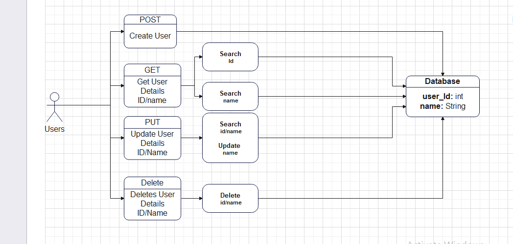

# HNGx Stage 2 Project Assignment - (CRUD)

## Description

A simple REST API capable of CRUD operatons on a "person" resource.

## Table of Contents

- [Installation](#installation)
- [Usage](#usage)
- [API Endpoints](#api-endpoints)
- [Testing](#testing)

## Installation

Follow this process to get the server up and running on your local machine

```bash
# Clone the repository
git clone https://github.com/abdullah43577/HNGx-Internship-Programme.git

# Navigate to the project directory
cd './HNGx INtTERNSHIP'
cd './HNGx Stage 2/'

# Install dependencies
npm install
```

one thing you should note is, cloning into my repository automatically downloads all other project folders I've used for previous project.

# Usage

### Start the API server

`npm run dev`

Your API is running on `http://localhost:8080`
for testing purposes append the `/api` at the end of the url to start making request based on methods specified `http://localhost:8080/api`

## API Endpoints

There are four (4) API endpoints in this project, and they all sum up doing the CRUD operation. Here's are the endpoints.

```
router.post('/api', controller.api_post_create_user);
router.get('/api', controller.api_get_getUserDetails);
router.put('/api', controller.api_put_updateUser);
router.delete('/api', controller.api_delete_deleteUser);
```

Each of the specified endpoints above creates, read, update and delete a user from a given database.

### POST /api

- create a new user
- Request body: `{"name": "Mike Essien"}`
- Response: `{"message": "user created", "user": {"id": dynamicIdGeneratedByMongoose, "name": "Mike Essien"}}`

### GET /api

- get user details by ID or name
- parameters: - `query` (string): User ID or name
- Response: `{ "message": "user found", "user": { "id": dynamicIdGeneratedByMongoose, "name": "Mike Essien" } }`

### PUT /api

- Update user details by ID or name
- parameters: - `query` (string): User ID or name
- Request Body: `{"name": "New Name"}`
- Response: `{"message": "user updated", "user": {"id": dynamicIdGeneratedByMongoose, "name": "New Name"}}`

### DELETE /api

- Delete a user by ID or name
- parameters: - `query` (string): User ID or name
- Response: `{"message": "user deleted"}`

# Testing Scripts

# UML Diagram


